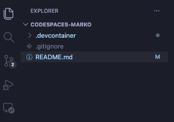
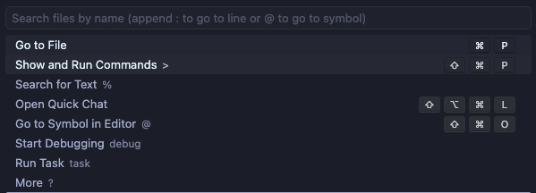
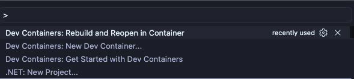

# Marko.build Devcontainer

A ready-to-use dev container for [Marko.build](https://marko.build) projects. Opens in VS Code Dev Containers or GitHub Codespaces and scaffolds a new Marko project automatically.

## What's included

- PHP (latest) + Composer
- Node.js (LTS) + Tailwind CSS
- MySQL or PostgreSQL (via Docker Compose)
- Redis (via Docker Compose)
- Docker-in-Docker
- Port 8000 forwarded for the dev server

## Getting started

Github Codespaces:

1. Fork the https://github.com/artmuscode/codespaces-marko

2. Edit section below in .devcontainer/devcontainer.json and save changes

"containerEnv": {
    		"MARKO_PROJECT_NAME": "palettes",
    		"MARKO_INSTALL_MODE": "skeleton",
    		"MARKO_PACKAGES": "marko/database marko/cache-redis marko/session marko/view marko/view-latte marko/security marko/testing marko/database-mysql marko/database-pgsql"
  	},

3. Edit .devcontainer/compose.yml and/or package.json to add required docker images/containers. Add NODE packages to package.json/ additional scripts etc. Save changes.

4. Open Github hamaburger menu Top Left -> select Codespaces

5. Click Green Button Top Right "New codespace"

6. Create a new codespace
-> Select a repository: "username/codespaces-marko"
-> Branch: main
-> Region: Default (US East)
-> Machine Type: Many options

7. Click Green Button "Create codespace"

8. New Window Open
-> VS Code like editor
-> Devcontainer will automatically start build process this will take a few minutes. Marko will be auto started along with docker containers defined in compose.yml and node packages will also install.


Deskop VS Code:

1. Clone this repository locally
    
2. Open the folder in VS Code 

    

    - Edit section below in .devcontainer/devcontainer.json and save changes

    Snippet area to change in devcontainer.json
    "containerEnv": {
    		"MARKO_PROJECT_NAME": "palettes",
    		"MARKO_INSTALL_MODE": "skeleton",
    		"MARKO_PACKAGES": "marko/database marko/cache-redis marko/session marko/view marko/view-latte marko/security marko/testing marko/database-mysql marko/database-pgsql"
  	},

    Edit .devcontainer/compose.yml and/or package.json to add required docker images/containers. Add NODE packages to package.json/ additional scripts etc. Save changes.


3. Click Show Commands
    


4. Click Dev Containers: Rebuild and Reopen in Container
    

5. VS Code will start devcontainer build, this will take a few minutes

6. Marko will be auto started along with docker containers defined in compose.yml and node packages will also install.

* Note running from Desktop VS Code requires Marko "host" configuration to be changes to "0.0.0.0". 
You will need to first run -> marko down -> add host 0.0.0.0 to marko project config -> then run marko up. 


## General Configuration

All project settings live in `.devcontainer/devcontainer.json` under `containerEnv`:

| Variable | Default | Description |
|---|---|---|
| `MARKO_PROJECT_NAME` | `project-name` | Folder name for the scaffolded project |
| `MARKO_INSTALL_MODE` | `skeleton` | `skeleton` or `framework` |
| `MARKO_PACKAGES` | see file | Space-separated Composer packages to install |

Change `MARKO_PROJECT_NAME` and rebuild — the project folder and shell PATH update automatically.

## Marko CLI

The `marko` CLI is available globally after the build:

```bash
marko        # list available commands
```

## Docker Compose services

A `compose.yml` is automatically copied into your project on first build. It defines the available backing services:

| Service | Image | Default port |
|---|---|---|
| `mysql` | `mysql:8.0` | `3306` |
| `postgres` | `postgres:16-alpine` | `5432` |
| `redis` | `redis:7-alpine` | `6379` |

MySQL and Redis are enabled by default. PostgreSQL is commented out. To switch databases, open `compose.yml` in your project, comment out the `mysql` block, and uncomment `postgres` (and the `postgres-data` volume).

`marko up` will start whichever services are active.

Default database credentials:

| Field | Value |
|---|---|
| Host | `localhost` |
| Database | project name (e.g. `palettes`) |
| User | `marko` |
| Password | `marko` |
| Root password | `root` |

## Node / Tailwind CSS

A `package.json` is automatically copied into your project on first build with [Tailwind CSS v4](https://tailwindcss.com) included as a dev dependency. `npm install` runs automatically during setup.

To add further packages:

```bash
npm install <package>
```

## Rebuilding

To reset and re-scaffold from scratch, rebuild the container:

- VS Code: **Dev Containers: Rebuild Container**
- Codespaces: **Codespaces: Rebuild Container**
